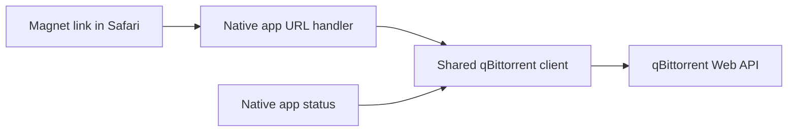

# Architecture

## Folder layout

- `local.xcconfig` holds ignored local signing values, server scheme and port, and server-bound API credentials and is referenced directly by both Xcode target configurations.
- `.codex/environments/environment.toml` defines the Codex Run action.
- `scripts/run.py` coordinates Release builds, device discovery, installation selection, and platform installers; `.derivedData/run/` contains ignored products and logs.
- `Magnet Relay.xcodeproj` defines the iOS and macOS app targets.
- `Shared (App)/` contains the native qBittorrent client, connection diagnostics, controls, and setup guidance shared across platforms.
- `iOS (App)/` and `macOS (App)/` contain platform-specific lifecycle and interface files.

## Component interactions

On both platforms, the registered `magnet:` scheme opens the native app. The shared client combines the server address saved in device preferences with the build-time scheme and port, submits the link, and checks connection status. The app displays the result and opens the server after a successful add. The macOS host then quits automatically.

The Run action builds macOS and physical iOS Release products, discovers available devices, and asks for installation targets through a native picker. It installs selected products with a staged bundle replacement on macOS and `devicectl` on physical iOS devices.

The shared client attaches the configured API key as a Bearer header only for its configured host. Requests refuse redirects to prevent credential forwarding. Credentials enter personal app bundles through local build settings.
