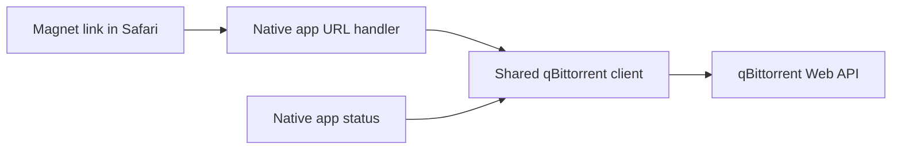

# Architecture

## Folder layout

- `local.xcconfig` holds ignored local signing values and the server endpoint and is referenced directly by both Xcode target configurations.
- `Magnet Relay.xcodeproj` defines the iOS and macOS app targets.
- `Shared (App)/` contains the native qBittorrent client, connection diagnostics, controls, and setup guidance shared across platforms.
- `iOS (App)/` and `macOS (App)/` contain platform-specific lifecycle and interface files.

## Component interactions

On both platforms, the registered `magnet:` scheme opens the native app. The shared client reads the build-time server endpoint, submits the link, and checks connection status. The app displays the result and opens the server after a successful add.
